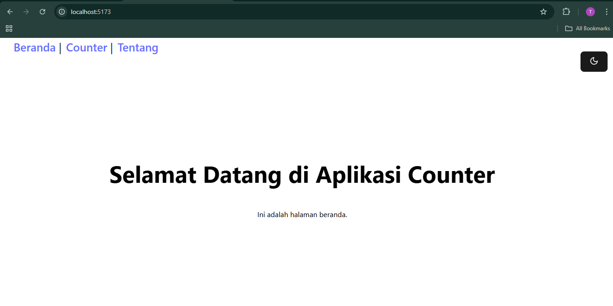
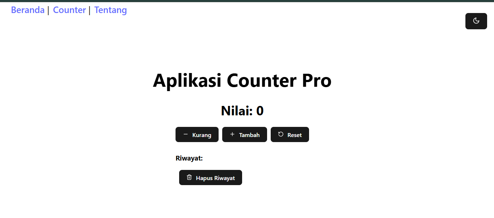
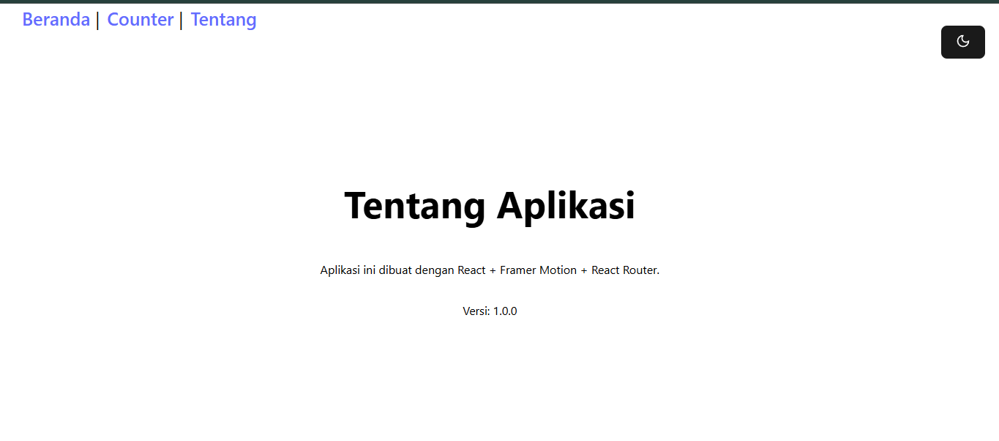
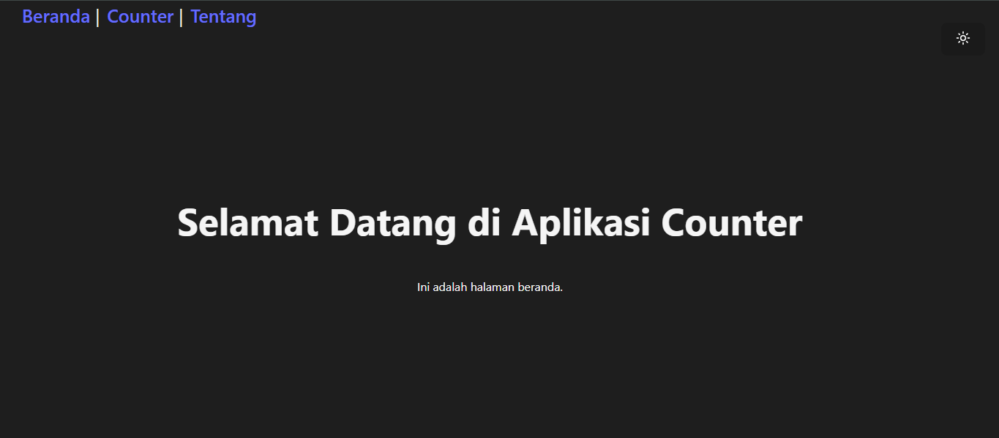

# 🧮 Counter App with React + Router + Animation

Sebuah aplikasi counter sederhana menggunakan **React**, **React Router Dom**, dan **Framer Motion**, lengkap dengan fitur navigasi, penyimpanan lokal, dan efek animasi modern.

## 🚀 Fitur Utama

- ✅ Tambah, kurang, dan reset nilai counter
- ✅ Simpan nilai dan riwayat di `localStorage`
- ✅ Riwayat aksi terakhir (terbatas 5 terakhir)
- ✅ Halaman terpisah menggunakan React Router:
  - `/` → Beranda
  - `/counter` → Halaman counter
  - `/about` → Informasi aplikasi
- ✅ Efek animasi halus dengan `framer-motion`
- ✅ Ikon interaktif dari `lucide-react`

---
## 🛠️ Instalasi & Menjalankan

### 1. Clone repositori
```bash
git clone https://github.com/TerranoJF/counter-app.git

cd counter-app

npm install

npm run dev``` 

Buka browser dan akses: http://localhost:5173

## 2. Cuplikan 




